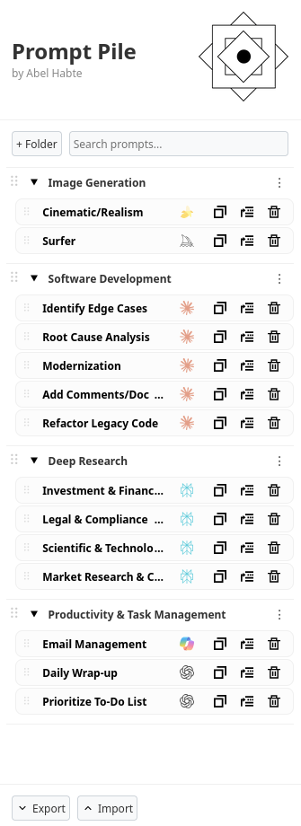
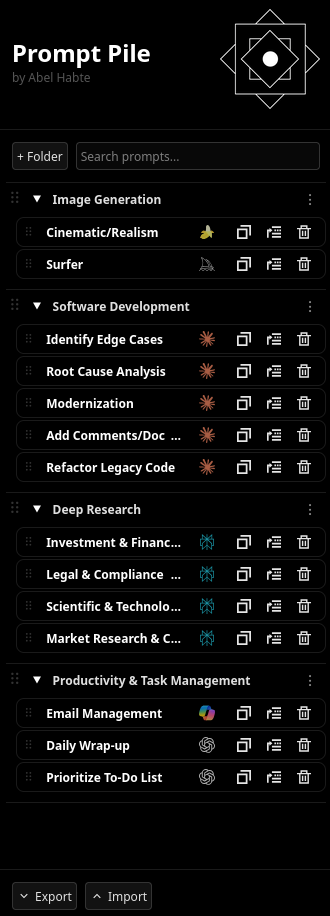
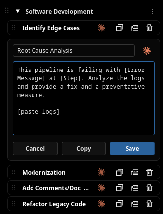

# Prompt Pile

**Prompt Pile** is a streamlined side bar web extension designed to save and organize AI prompts. Regardless of whatever model you are currently using, this tool helps maintain a personal library of high-performing prompts to optimize your AI interactions.

---

 
 

## Key Features

* **Nested & Fluid Organization:** Group prompts into custom folders. Drag-and-drop handles are available to reorder both your folders and the prompts inside.
* **Model Categorization:** Tag prompts for specific models like ChatGPT, Claude, Gemini, and etc.
* **Prompt Mobility:** Easily move prompts between folders or edit them on the fly.
* **Advanced Clipboard Tool:** Copy prompts with a single click; includes visual feedback and preserves multi-line formatting.
* **Persistent Dark Mode:** Toggle between light and dark themes, with preferences saved automatically.
* **JSON Backups:** Export your entire library to a single JSON file for easy migration.

---

## Getting Started

### Installation

#### Extension Store
Install Prompt Pile directly from your browser's official marketplace:
* **Chrome Web Store**
* **Firefox Add-ons**

#### Local Install
If you want to run Prompt Pile locally:
1. Clone the Repository: `git clone https://github.com/abelhabte/prompt-pile.git`
2. Open Extension Management:
    * Chrome: Navigate to `chrome://extensions/` and turn on Developer mode.
    * Firefox: Navigate to `about:debugging#/runtime/this-firefox`.
3. Load the Extension:
    * Chrome: Click Load unpacked and select the project folder.
    * Firefox: Click Load Temporary Add-on and select the manifest.json file.

### Basic Usage
* **Create a Folder:** Click the `+ Folder` button to create a new folder.
* **Manage Prompts:** Use the three-dot menu on any folder to add a new prompt, rename the folder, or delete the folder.
* **Quick Copy:** Click the `Copy` button on a saved prompt to instantly add the text to your clipboard.
* **Import Library:** Provided that you have a compatible JSON file, you can simply click `Λ Import` to import a previous backup.

---

## Technical Stack
* **HTML**
* **CSS**
* **JavaScript**
* **Manifest V3**
